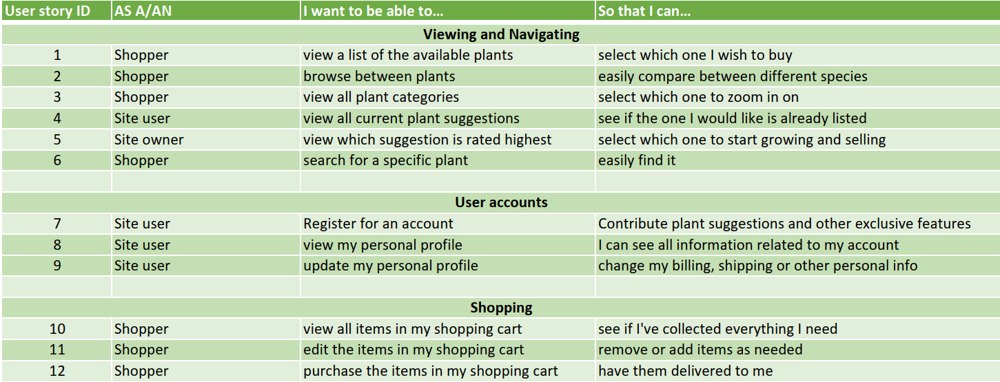

---

Food plants to Grow is a website dedicated to providing users with the opportunity to purchase the plants they need to grow their own food. Users can also suggest plants to add to the website, using a rating system. This site is connected with the "Recipe to Grow" website, which contains plant based recipes. 

**-- [See live site on Heroku]() --**

---

## Table of contents

**

User Experience
**
  - [User stories](#user-stories)
  - [Strategy](#strategy)
  - [Scope](#scope)
  - [Structure](#structure)
  - [Skeleton](#skeleton)
  - [Surface](#surface)

**

Features
**
  - [Existing features](#existing-features)
  - [Future features](#future-features)

**

Technologies Used
**
  - [Languages](#languages)
  - [Libraries, Frameworks and programs](#Libraries,-Frameworks-and-programs)

**

Testing
**
  - [Test documentation](https://github.com/ElkeJohannes/Recipe-to-grow/blob/main/TESTING.md)

**

Deployment
**
  - [Deployment to GitHub pages](#deployment-to-github-pages)
  - [Forking this repository](#forking-this-repository)
  - [Local deployment](#local-deployment)

**

Credits
**
  - [Text](#text)
  - [Media](#media)
  - [Acknowledgements](#acknowledgements)

---

## &rarr; **User Experience**

### **<ins>User stories</ins>**

### **<ins>Strategy</ins>**

### **<ins>Scope</ins>**

### **<ins>Structure</ins>**

### **<ins>Skeleton</ins>**
The following wireframes were made using Balsamiq to give a rough idea of the project.
- [Home page](media/readme_files/wireframe_home.png)
- [Plant overview page](media/readme_files/wireframe_plants.png)
- [Suggestions page](media/readme_files/wireframe_suggestions.png)
- [Login page](media/readme_files/wireframe_login.png)
- [Contact page](media/readme_files/wireframe_contact.png)

### **<ins>Surface</ins>**

---

## &rarr; **Features**

#### **<ins>Existing features</ins>**
|#|Name|Description|
|-|-|-|

#### **<ins>Future features</ins>**
|#|Name|Description|
|-|-|-|

---

## &rarr; **Technologies Used**
### **<ins>Languages</ins>**

| 
HTML5
 | 
CSS3
 | 
Javascript
 | 
Python
 |
|-|-|-|-|
|  |  |  |  |

### **<ins>Libraries, Frameworks and programs</ins>**
- [JQuery 3.5.1](https://jquery.com/)
  * Used for easier DOM access.
- [Django 4.0](https://www.djangoproject.com/)
  * Used as the framework for the site to speed up development.  
- [Bootstrap 5.1.0](https://getbootstrap.com/docs/5.1/getting-started/introduction/)
  * Used widely troughout the site to speed up layout design.
- [Multi device mockup generator](http://techsini.com/multi-mockup/index.php)
  * Used to create the header image of this readme file.
- [Favicon generator](https://favicon.io/favicon-generator/)
  * Used to create a custom favicon.

---

## &rarr; **Deployment** 
### **<ins>Deployment to Heroku</ins>**
1. Created the project on Github. Git and Github were also used for the version control.
2. Created a new, empty app on Heroku
3. Linked the Github repository to the app
4. Created the Config Vars on the settings page of the app. In order to make the application work for yourself, ensure you create the following keys here:
   - SECRET_KEY (needed for Flash messages)
5. From the deploy page, ran a manual deploy, after which, automatic deployment was enabled for the 'main' branch

### **<ins>Forking this repository</ins>**
1. Login to [GitHub](https://github.com)
2. Browse to the [repository](https://github.com/ElkeJohannes/food-plants-to-grow)
3. On the top right of the page, there should be a button that says 'Fork'. Click on this button to fork a copy of the site to your own repositories.

---

## &rarr; **Credits**

### **<ins>Text</ins>**

### **<ins>Media</ins>**

### **<ins>Acknowledgements</ins>** 
- Shop template taken from [Startbootstrap.com](https://startbootstrap.com/template/shop-homepage)
- Color sheme from [Colorhunt.co](https://colorhunt.co/palette/125c133e7c17f4a442e8e1d9)
- Tutorial for adding extra fields to users [cpadiernos](https://cpadiernos.github.io/how-to-add-fields-to-the-user-model-in-django.html)
- The following stackoverflow questions:
  - [Filtering by category](https://stackoverflow.com/questions/4062955/django-foreign-key-queries)
  - [Resetting django db](https://stackoverflow.com/questions/44651760/django-db-migrations-exceptions-inconsistentmigrationhistory)