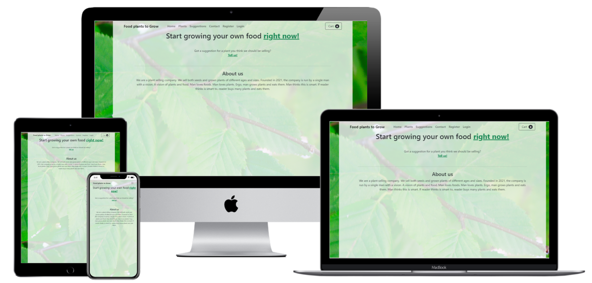

---

Food plants to Grow is a website dedicated to providing users with the opportunity to purchase the plants they need to grow their own food. Users can also suggest plants to add to the website, using a rating system. This site is connected with the "Recipe to Grow" website, which contains plant based recipes. 

**-- [See live site on Heroku](https://ejh-food-plants-to-grow.herokuapp.com/) --**

Note that this is a showcase website. The plants advertised will not actually be delivered. 

---

## Table of contents

**

User Experience
**
  - [User stories](#user-stories)
  - [Strategy](#strategy)
  - [Scope](#scope)
  - [Structure](#structure)
  - [Skeleton](#skeleton)
  - [Surface](#surface)

**

Features
**
  - [Existing features](#existing-features)
  - [Future features](#future-features)

**

Technologies Used
**
  - [Languages](#languages)
  - [Libraries, Frameworks and programs](#Libraries,-Frameworks-and-programs)

**

Testing
**
  - [Test documentation](https://github.com/ElkeJohannes/food-plants-to-grow/blob/main/TESTING.md)

**

Deployment
**
  - [Deployment to GitHub pages](#deployment-to-github-pages)
  - [Forking this repository](#forking-this-repository)
  - [Local deployment](#local-deployment)

**

Credits
**
  - [Text](#text)
  - [Media](#media)
  - [Acknowledgements](#acknowledgements)

---

## &rarr; **User Experience**

### **<ins>User stories</ins>**

### **<ins>Strategy</ins>**
The main purpose of the website is to allow the shop owner to sell his plants online, and for users to purchase them. The site is slightly community driven in that it receives input on which plants to sell from the users. 

### **<ins>Scope</ins>**
The site will have a plants page where you can search for a plant and add it to your shoppingcart. Additionally it will have a suggestions page to submit plant suggestions. 

### **<ins>Structure</ins>**
The main page has links that bring you to the most important parts of the site right away. The menu will collapse into a hamburger menu on tablet or smaller sizes. Each action takes the user to the next logical place to go. For instance after clicking on 'Add to cart' the user is brought to their shoppingcart. 

### **<ins>Skeleton</ins>**
The following wireframes were made using Balsamiq to give a rough idea of the project.
- [Home page](media/readme_files/wireframe_home.png)
- [Plant overview page](media/readme_files/wireframe_plants.png)
- [Suggestions page](media/readme_files/wireframe_suggestions.png)
- [Login page](media/readme_files/wireframe_login.png)
- [Contact page](media/readme_files/wireframe_contact.png)

### **<ins>Surface</ins>**
A bright green image featuring leaves from the Beech tree is visible through a transparant background. Overall the site will feature mostly green buttons, but will otherwise be low in colour usage. 

---

## &rarr; **Features**

#### **<ins>Existing features</ins>**
|#|Name|Description|
|-|-|-|
|1|Register|Create a personal account to contain your order history and your address information|
|2|Login|Login to enable additional features|
|3|Search for a plant|Users can search for a common name, botanical name and a description|
|4|Filter by category|users can select a category to view only the plants that fall under that category|
|5|Change amount in shoppingcart|Users can change the amount of plants in their shoppingcart or remove plants altogether|
|6|Make a purchase|Users can perform a checkout, and purchase plants|
|7|Edit address information|After logging in, users can view and edit their address information|
|8|Make a plant suggestion|After logging in, users can make a new plant suggestion, or upvote an existing one|

#### **<ins>Future features</ins>**
|#|Name|Description|
|-|-|-|
|1|Order history|Enabling users to view their order history after logging in|
|2|Dynamic search|This will display search results while typing instead of after pressing the search button|
|3|Captcha on contactform|This denies malicious users to send spam from the website|

---

## &rarr; **Technologies Used**
### **<ins>Languages</ins>**

| 
HTML5
 | 
CSS3
 | 
Javascript
 | 
Python
 |
|-|-|-|-|
|  |  |  |  |

### **<ins>Libraries, Frameworks and programs</ins>**
- [JQuery 3.5.1](https://jquery.com/)
  * Used for easier DOM access.
- [Django 4.0](https://www.djangoproject.com/)
  * Used as the framework for the site to speed up development.  
- [Bootstrap 5.1.0](https://getbootstrap.com/docs/5.1/getting-started/introduction/)
  * Used widely troughout the site to speed up layout design.
- [Multi device mockup generator](http://techsini.com/multi-mockup/index.php)
  * Used to create the header image of this readme file.
- [Favicon generator](https://favicon.io/favicon-generator/)
  * Used to create a custom favicon.
- Various python modules, entire list visible in [Requirements file](https://github.com/ElkeJohannes/food-plants-to-grow/blob/main/requirements.txt)

---

## &rarr; **Deployment** 
### **<ins>Deployment to Heroku</ins>**
1. Clone the project on Github.
2. Create a new, empty app on Heroku
3. Link the cloned Github repository to the Heroku app
4. Add a Postgress database to your Heroku app
5. Create the Config Vars on the settings page of the app. In order to make the application work, ensure you create the following keys here:
   - AWS_ACCESS_KEY_ID 
      - <i>From AWS, you can find this in your bucket</i>
   - AWS_SECRET_ACCESS_KEY
      - <i>From AWS, visible when creating a user</i>
   - DATABASE_URL
      - <i>Automatically created after adding a postgress DB</i>
   - EMAIL_HOST_PASSWORD
      - <i>Password used for sending emails</i>
   - EMAIL_HOST_USER
      - <i>User used for sending emails</i>
   - SECRET_KEY
      - <i>Django secret key, randomly generated</i>
   - STRIPE_PUBLIC_KEY
      - <i>From Stripe. One half of a keypair</i>
   - STRIPE_SECRET_KEY
      - <i>From Stripe. The other half of the keypair</i>
   - STRIPE_WH_SECRET
      - <i>From Stripe. Used for webhooks</i>
   - USE_AWS
      - <i>Wether to use AWS as storage for the static files</i>
6. Create or log into an AWS account, and create a new bucket. This will serve as storage for your static files. 
7. Set the access (viewing) of the AWS bucket to public.
8. Create a user that will be used to manage the files
9. From the deploy page, run a manual deploy. 
10. If the build is succesfull, you can enable automatic deployment for the cloned Github repository.
11. Create or log into a Stripe account. 
12. Create a new webhook, using the URL from your deployed website

You should now have a functioning website. If the build doesn't succeed or the website generates an error during loading, ensure all keys are added correctly. 

### **<ins>Forking this repository</ins>**
1. Login to [GitHub](https://github.com)
2. Browse to the [repository](https://github.com/ElkeJohannes/food-plants-to-grow)
3. On the top right of the page, there should be a button that says 'Fork'. Click on this button to fork a copy of the site to your own repositories.

---

## &rarr; **Credits**

### **<ins>Text</ins>**
- All plant common and botanical names as well as the descriptions were taken from: [foodforestnursery.com](https://foodforestnursery.com/)

### **<ins>Media</ins>**
- All plant images were also taken from: [foodforestnursery.com](https://foodforestnursery.com/)

### **<ins>Acknowledgements</ins>** 
- Thanks to my mentor Nishant, for the support, knowhow and general advice on how to make a decent website.
- Shop template taken from [Startbootstrap.com](https://startbootstrap.com/template/shop-homepage)
- Color sheme from [Colorhunt.co](https://colorhunt.co/palette/125c133e7c17f4a442e8e1d9)
- Tutorial for adding extra fields to users [cpadiernos](https://cpadiernos.github.io/how-to-add-fields-to-the-user-model-in-django.html)
- Converting string to list [Geeks for Geeks](https://www.geeksforgeeks.org/python-program-convert-string-list/)
- The following stackoverflow questions:
  - [Filtering by category](https://stackoverflow.com/questions/4062955/django-foreign-key-queries)
  - [Resetting django db](https://stackoverflow.com/questions/44651760/django-db-migrations-exceptions-inconsistentmigrationhistory)