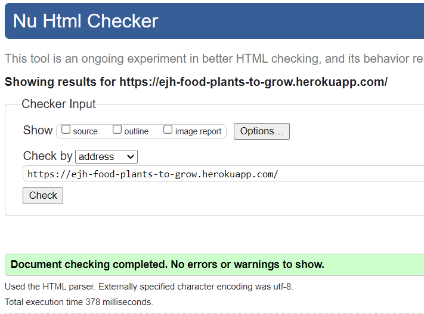
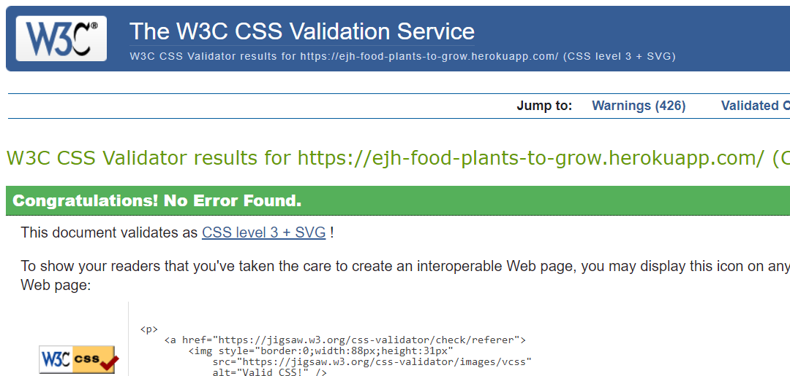

## <ins>**Testing**</ins>

---

**

Table of contents
**
  - [Code validation](#code-validation)
  - [User story tests](#user-story-tests)
  - [Manual testing script](#manual-testing-script)
  - [Feature test scripts](#feature-test-scripts)
  - [Bugs](#bugs)

---

## &rarr; **Code validation**
- Tested for valid HTML code using [w3 validator](https://validator.w3.org/nu/) 

- Tested for valid CSS code using [Jigsaw validator](https://jigsaw.w3.org/css-validator/) 
 

- Continuous validation of python code using installed plugin [Pylance](https://github.com/microsoft/pylance-release) 

---

## &rarr; **User story tests**

---

## &rarr; **Manual testing script**
In all below testing actions, it is assumed you have opened the website on **any** device. 

|Test name|Actions|
|-|-|
|<ins>title</ins>|Action   Action 2|

---

## &rarr; **Feature test scripts**
For testing, 2 device types are defined:
- Mobile
    * Any device with a horizontal screen width **smaller** then 567px. This can also be achieved using browser developer tools.
- Mobile+
    * Any device with a horizontal screen width **larger** then 567px

|1|Title|
|-|-|
- Action 1
- Action 2

---

## &rarr; **Bugs**
1. Plant image doesn't show up when viewing the cart  
   <i>The image is visible when viewing viewing it from the plants pages.</i> 
---